## Hi there 👋 I’m Amit Kumar

React Native & Android Developer with **5+ years of experience** building, shipping, and maintaining real-world mobile applications.  
I’ve published **10+ apps**, including production React Native apps under [**Destya Studio**](https://destyastudio.com/) and earlier Android apps with **1M+ total installs**.

I enjoy turning ideas and designs into **polished, high-performance mobile experiences** - offline-first, Firebase-backed, and built for real users.

---

### 📊 GitHub Statistics

  
  
  

  

---

### 🚀 What I’m working on
- Building and scaling **React Native apps** used by real users
- Improving **performance, UX, and reliability** across Android devices
- Exploring **AI-powered features** in mobile apps (OpenAI, smart content, personalization)

---

### 💼 Professional Focus
- React Native (production apps, Play Store publishing)
- Firebase (Auth, Firestore, Analytics, Crashlytics, Cloud Messaging)
- Offline-first apps, custom animations, and UX refinements
- End-to-end development in small, remote teams

---

### 🧠 Tech Stack

**Languages**  

**Frameworks & Libraries**  

**Tools & Platforms**  

---

### 📱 Selected Projects

**CodeRespite**  
Self-paced mobile learning app with lessons, quizzes, flashcards & offline support  
Tech: React Native, Firebase  
👉 [PlayStore](https://play.google.com/store/apps/details?id=com.mindcraftlearning.coderespite)

**Spin the Wheel - Pick for Me**  
Custom decision wheels with sounds, haptics & offline support  
👉 [PlayStore](https://play.google.com/store/apps/details?id=com.mindcraftlearning.spinthewheel)

**AI Icebreaker: Question Games**  
Conversation starter app for friends, couples & families  
👉 [PlayStore](https://play.google.com/store/apps/details?id=com.mindcraftlearning.questiongames)
👉 [AppStore](https://apps.apple.com/us/app/ai-icebreaker-question-games/id6759521053)

**Trivia Quest AI**  
AI-powered trivia app with smart explanations, progress tracking, and leaderboards  
Tech: React Native, OpenAI API, Firebase  
👉 [PlayStore](https://play.google.com/store/apps/details?id=com.coderespite.triviaquestai)

**Cheesy Lines**  
Pick-up line app with bookmarks, sharing & offline mode  
👉 [PlayStore](https://play.google.com/store/apps/details?id=com.mindcraftlearning.cheezylines)

### 🌐 Web Projects
- [**CodeRespite.com**](https://coderespite.com) - personal portfolio & technical hub
  
- [**destyastudio.com**](https://destyastudio.com) - Destya Studio
  

---

---

### 🤝 Open to Opportunities

I’m currently open to:
- Remote **React Native** roles
- Mobile-heavy full-stack projects
- Contract or long-term collaboration with small, focused teams

I work best where **product quality, performance, and user experience** matter.

---

### 📫 Let’s connect
- 📧 Email: **amit@coderespite.com**
- 🌐 Portfolio: https://amit.coderespite.com/
- 💼 LinkedIn: https://linkedin.com/in/amit265
- 🧑‍💻 GitHub: https://github.com/amit265

---

⚡ Fun fact: I started coding by building Android apps in Java - and I still care deeply about performance, not just shiny UI.
